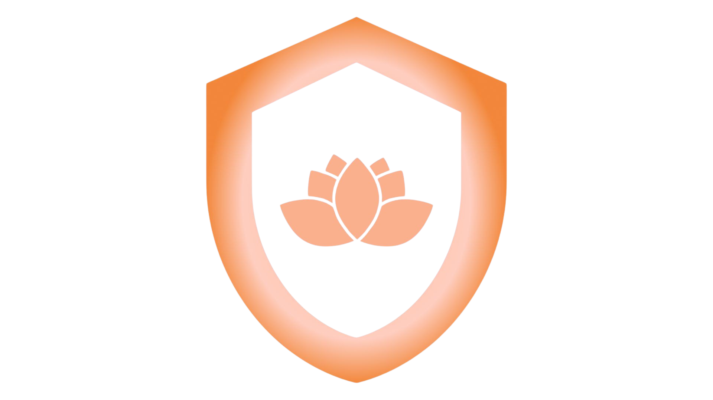

# 🌸 Dermalyze - Analisis Kulit dengan AI



**Dermalyze** adalah aplikasi web modern yang menggunakan teknologi Machine Learning untuk menganalisis jenis kulit dan memberikan rekomendasi produk skincare yang personal. Aplikasi ini dibangun dengan React dan menggunakan arsitektur MVP (Model-View-Presenter) untuk maintainability yang lebih baik.

## ✨ Fitur Utama

### 🔍 Analisis Kulit AI

- **Upload foto atau ambil foto langsung** dari kamera
- **Analisis real-time** menggunakan teknologi Machine Learning
- **Deteksi jenis kulit** (Normal, Berminyak, Kering, Kombinasi, Sensitif)
- **Tingkat akurasi tinggi** dengan confidence score

### 💄 Rekomendasi Produk Personal

- **Katalog produk skincare** yang lengkap
- **Filter berdasarkan jenis kulit** dan kebutuhan
- **Rekomendasi yang dipersonalisasi** berdasarkan hasil analisis
- **Informasi detail produk** dengan rating dan review

### 📚 Edukasi Skincare

- **Artikel informatif** tentang perawatan kulit
- **Tips dan trik** skincare untuk berbagai jenis kulit
- **Panduan lengkap** cara merawat kulit yang benar

### 👤 Sistem Autentikasi

- **Registrasi dan login** yang aman
- **Profil pengguna** dengan riwayat analisis
- **Sistem poin** untuk engagement pengguna

## 🛠️ Teknologi yang Digunakan

### Frontend

- **React 19.1.0** - Library UI modern
- **Vite 6.3.5** - Build tool yang cepat
- **Tailwind CSS 3.4.17** - Framework CSS utility-first
- **MediaPipe** - Library untuk computer vision

### Backend & Database

- **PocketBase** - Backend-as-a-Service
- **Flask API** - Server untuk ML processing
- **Machine Learning Model** - Custom trained model untuk skin analysis

### Development Tools

- **PostCSS** - CSS processing
- **Autoprefixer** - CSS vendor prefixes
- **Terser** - JavaScript minification

## 🚀 Cara Menjalankan Aplikasi

### Prasyarat

- Node.js (versi 16 atau lebih baru)
- npm atau yarn
- Git

### Instalasi

1. **Clone repository**

```bash
git clone <repository-url>
cd dermalyze
```

2. **Install dependencies**

```bash
npm install
```

3. **Setup environment variables**

```bash
# Copy file environment
cp .env.development .env.local

# Edit file .env.local sesuai kebutuhan
```

4. **Jalankan development server**

```bash
npm run dev
```

5. **Buka browser** dan akses `http://localhost:5173`

### Build untuk Production

```bash
# Build aplikasi
npm run build

# Preview build
npm run preview
```

## 📁 Struktur Proyek

```
dermalyze/
├── public/                 # Static assets
│   ├── images/            # Gambar dan logo
│   ├── favicon.png        # Favicon
│   └── manifest.json      # PWA manifest
├── src/                   # Source code
│   ├── components/        # React components
│   ├── core/             # MVP core infrastructure
│   ├── models/           # Data models
│   ├── presenters/       # Business logic
│   ├── services/         # API services
│   ├── scripts/          # Utility scripts
│   ├── styles/           # CSS files
│   └── views/            # View components
├── dist/                 # Build output
├── package.json          # Dependencies
└── vite.config.js        # Vite configuration
```

## 🎯 Arsitektur MVP

Aplikasi ini menggunakan pola **Model-View-Presenter (MVP)** untuk pemisahan concern yang lebih baik:

- **Model**: Mengelola data dan business logic
- **View**: Menampilkan UI dan menerima input user
- **Presenter**: Menghubungkan Model dan View

### Keuntungan MVP:

- ✅ **Testability** yang lebih baik
- ✅ **Separation of concerns** yang jelas
- ✅ **Maintainability** yang tinggi
- ✅ **Scalability** untuk fitur baru

## 🌐 Deployment

### Vercel (Recommended)

```bash
# Install Vercel CLI
npm i -g vercel

# Deploy
vercel --prod
```

### Netlify

```bash
# Build command
npm run build

# Publish directory
dist
```

### Manual Server

```bash
# Build aplikasi
npm run build

# Upload folder dist ke server
# Configure web server untuk SPA routing
```

## 🔧 Konfigurasi Environment

### Development (.env.development)

```env
VITE_API_BASE_URL=http://52.77.219.198:3000/api
VITE_POCKETBASE_URL=http://52.77.219.198:8090
VITE_RAPIDAPI_KEY=your_rapidapi_key
VITE_RAPIDAPI_HOST=contextualwebsearch-websearch-v1.p.rapidapi.com
VITE_ENABLE_LOGGING=true
```

### Production (.env.production)

```env
VITE_API_BASE_URL=http://52.77.219.198:3000/api
VITE_POCKETBASE_URL=http://52.77.219.198:8090
VITE_RAPIDAPI_KEY=your_rapidapi_key
VITE_RAPIDAPI_HOST=contextualwebsearch-websearch-v1.p.rapidapi.com
VITE_ENABLE_LOGGING=false
```

## 📱 Fitur PWA

Dermalyze mendukung **Progressive Web App (PWA)**:

- ✅ **Installable** di mobile dan desktop
- ✅ **Offline support** untuk fitur dasar
- ✅ **Responsive design** untuk semua device
- ✅ **Fast loading** dengan service worker

## 🎨 Design System

### Color Palette

- **Primary**: `#FF9B7A` (Derma Salmon)
- **Secondary**: `#FFDCDC` (Derma Cream)
- **Accent**: `#FFB5B5` (Derma Rose)
- **Neutral**: `#F5F5F5` (Derma Peach)

### Typography

- **Font Family**: System fonts untuk performa optimal
- **Font Sizes**: Responsive dengan Tailwind CSS
- **Font Weights**: 400 (normal), 600 (semibold), 700 (bold)

## 🧪 Testing

```bash
# Run tests (jika ada)
npm test

# Run linting
npm run lint

# Type checking
npm run type-check
```

## 📊 Performance

### Optimisasi yang Diterapkan:

- ✅ **Code splitting** dengan React.lazy
- ✅ **Image optimization** dengan lazy loading
- ✅ **Bundle optimization** dengan Vite
- ✅ **CSS purging** dengan Tailwind CSS
- ✅ **Minification** untuk production build

### Metrics Target:

- **First Contentful Paint**: < 1.5s
- **Largest Contentful Paint**: < 2.5s
- **Cumulative Layout Shift**: < 0.1
- **First Input Delay**: < 100ms

## 🔒 Security

### Implementasi Keamanan:

- ✅ **Authentication** dengan JWT tokens
- ✅ **Input validation** di frontend dan backend
- ✅ **HTTPS** untuk production
- ✅ **Environment variables** untuk sensitive data
- ✅ **CORS** configuration yang proper

## 🤝 Contributing

1. **Fork** repository ini
2. **Create feature branch** (`git checkout -b feature/AmazingFeature`)
3. **Commit changes** (`git commit -m 'Add some AmazingFeature'`)
4. **Push to branch** (`git push origin feature/AmazingFeature`)
5. **Open Pull Request**

### Coding Standards:

- Gunakan **ESLint** dan **Prettier**
- Ikuti **naming conventions** yang konsisten
- Tulis **comments** untuk logic yang kompleks
- Buat **tests** untuk fitur baru

## 📝 Changelog

### Version 1.0.0-mvp

- ✅ Implementasi MVP architecture
- ✅ Skin analysis dengan AI
- ✅ Product recommendation system
- ✅ User authentication
- ✅ Responsive design
- ✅ PWA support

## 🐛 Known Issues

- [ ] **Image upload** kadang lambat pada koneksi slow
- [ ] **Mobile camera** perlu permission handling yang lebih baik
- [ ] **Offline mode** belum fully functional

## 📞 Support

Jika Anda mengalami masalah atau memiliki pertanyaan:

- **Email**: support@dermalyze.com
- **GitHub Issues**: [Create an issue](https://github.com/your-repo/dermalyze/issues)
- **Documentation**: [Wiki](https://github.com/your-repo/dermalyze/wiki)

## 📄 License

Distributed under the MIT License. See `LICENSE` for more information.

## 🙏 Acknowledgments

- **MediaPipe** untuk computer vision library
- **Unsplash** untuk stock photos
- **Tailwind CSS** untuk design system
- **React Community** untuk ecosystem yang luar biasa

---

**Dibuat dengan ❤️ oleh Tim Dermalyze**

_Temukan skincare yang tepat untuk kulitmu dengan teknologi AI terdepan!_
